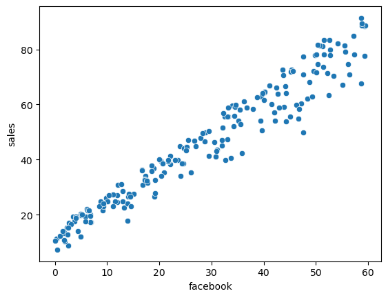

# Regression & Classification Metrics Analysis


## Project Overview
This project explores regression and classification modeling techniques using Python and machine learning workflows. The analysis focuses on evaluating predictive performance, understanding relationships between variables, and comparing regression and classification model behavior.

The repository includes:
- linear regression modeling
- logistic regression modeling
- classification analysis
- predictive metrics evaluation
- visualization of variable relationships
- model serialization using Joblib

---

# Project Objectives
- Build predictive regression models
- Explore classification workflows
- Evaluate regression and classification metrics
- Visualize relationships between marketing variables
- Save trained machine learning models for reuse and deployment

---

# Tools & Technologies
- Python
- pandas
- numpy
- matplotlib
- scikit-learn
- joblib
- Jupyter Notebook
- Machine Learning

---

# Repository Structure

```text
Regression-Classification-Metrics/
│
├── Data/
│
├── Images/
│   └── Scatter.png
│
├── Notebooks/
│   └── regression_classification_metrics.ipynb
│
├── Reports/
│
├── linear_regression.joblib
├── logistic_regression.joblib
├── marketing.csv
│
└── README.md
```

---

# Exploratory Analysis

The project examined relationships between marketing variables and sales outcomes using regression analysis and predictive modeling techniques.

The scatterplot visualization below demonstrates the relationship between:
- Facebook advertising spend
- sales performance

---

# Marketing Relationship Visualization

The scatterplot shows a strong positive linear relationship between Facebook advertising spend and sales outcomes.



---

# Regression Modeling

The project implemented linear regression models to:
- evaluate relationships between variables
- predict sales outcomes
- estimate continuous numerical targets
- analyze model fit and predictive behavior

Regression workflows included:
- feature evaluation
- model training
- prediction generation
- metric analysis

---

# Classification Modeling

The project also explored logistic regression classification techniques to:
- classify outcomes
- evaluate probability-based predictions
- compare regression versus classification approaches
- assess predictive performance metrics

Classification analysis included:
- model training
- prediction analysis
- classification evaluation

---

# Model Serialization

Trained machine learning models were saved using Joblib for future reuse and deployment.

Serialized models include:
- `linear_regression.joblib`
- `logistic_regression.joblib`

This workflow supports:
- reproducibility
- deployment readiness
- efficient model reuse

---

# Key Findings
- Facebook advertising spend demonstrated a strong positive relationship with sales.
- Regression models captured clear linear predictive patterns.
- Classification workflows highlighted differences between continuous and categorical prediction approaches.
- Model serialization improves portability and deployment efficiency.
- Visualization supported interpretation of predictive relationships and model behavior.

---

# Skills Demonstrated
- Linear regression
- Logistic regression
- Predictive modeling
- Classification analysis
- Machine learning workflows
- Model serialization
- Exploratory data analysis
- Python programming
- Data visualization

---

# Supporting Files

This repository includes:
- Jupyter notebooks
- machine learning models
- regression outputs
- exploratory visualizations
- serialized Joblib models

---

# Data

This project uses marketing and predictive modeling datasets to evaluate regression and classification workflows.

The datasets were used to:
- analyze relationships between variables
- predict sales outcomes
- evaluate machine learning model performance
- demonstrate regression and classification techniques

---

# Author

Cameron Batts

GitHub: https://github.com/Cameron-Batts

Portfolio: https://cameronbatts.github.io
